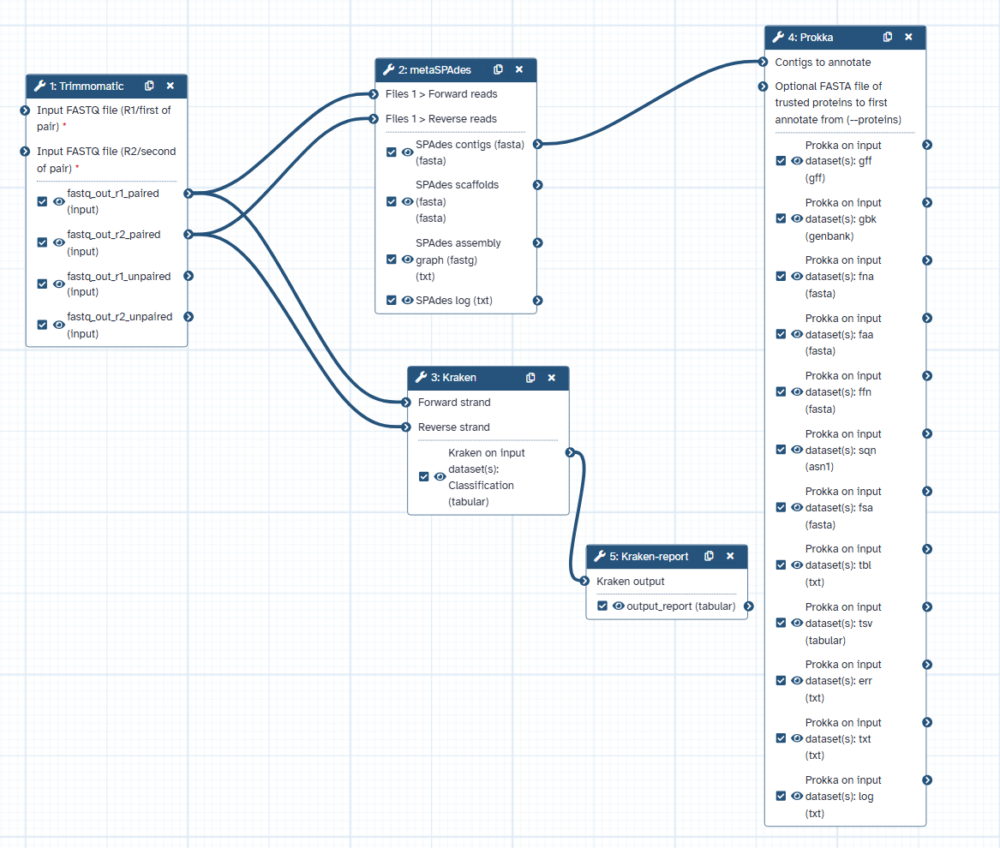

+ [metagenomics workflow](https://usegalaxy.org/u/yangwang1749/w/imported-metagenomics)




```json

{
    "a_galaxy_workflow": "true",
    "annotation": "metagenome workflow",
    "comments": [],
    "format-version": "0.1",
    "name": "metagenomics",
    "report": {
        "markdown": "\n# Workflow Execution Report\n\n## Workflow Inputs\n```galaxy\ninvocation_inputs()\n```\n\n## Workflow Outputs\n```galaxy\ninvocation_outputs()\n```\n\n## Workflow\n```galaxy\nworkflow_display()\n```\n"
    },
    "steps": {
        "0": {
            "annotation": "",
            "content_id": "toolshed.g2.bx.psu.edu/repos/pjbriggs/trimmomatic/trimmomatic/0.38.0",
            "errors": null,
            "id": 0,
            "input_connections": {},
            "inputs": [
                {
                    "description": "runtime parameter for tool Trimmomatic",
                    "name": "readtype"
                },
                {
                    "description": "runtime parameter for tool Trimmomatic",
                    "name": "readtype"
                }
            ],
            "label": null,
            "name": "Trimmomatic",
            "outputs": [
                {
                    "name": "fastq_out_r1_paired",
                    "type": "input"
                },
                {
                    "name": "fastq_out_r2_paired",
                    "type": "input"
                },
                {
                    "name": "fastq_out_r1_unpaired",
                    "type": "input"
                },
                {
                    "name": "fastq_out_r2_unpaired",
                    "type": "input"
                }
            ],
            "position": {
                "left": 0,
                "top": 60
            },
            "post_job_actions": {},
            "tool_id": "toolshed.g2.bx.psu.edu/repos/pjbriggs/trimmomatic/trimmomatic/0.38.0",
            "tool_shed_repository": {
                "changeset_revision": "898b67846b47",
                "name": "trimmomatic",
                "owner": "pjbriggs",
                "tool_shed": "toolshed.g2.bx.psu.edu"
            },
            "tool_state": "{\"__job_resource\": {\"__current_case__\": 0, \"__job_resource__select\": \"no\"}, \"illuminaclip\": {\"do_illuminaclip\": true, \"__current_case__\": 0, \"adapter_type\": {\"standard_or_custom\": \"standard\", \"__current_case__\": 0, \"adapter_fasta\": \"NexteraPE-PE.fa\"}, \"seed_mismatches\": \"2\", \"palindrome_clip_threshold\": \"30\", \"simple_clip_threshold\": \"10\", \"min_adapter_len\": \"8\", \"keep_both_reads\": true}, \"operations\": [{\"__index__\": 0, \"operation\": {\"name\": \"SLIDINGWINDOW\", \"__current_case__\": 0, \"window_size\": \"4\", \"required_quality\": \"20\"}}], \"output_err\": false, \"output_logs\": false, \"readtype\": {\"single_or_paired\": \"pair_of_files\", \"__current_case__\": 1, \"fastq_r1_in\": {\"__class__\": \"RuntimeValue\"}, \"fastq_r2_in\": {\"__class__\": \"RuntimeValue\"}}, \"__page__\": null, \"__rerun_remap_job_id__\": null}",
            "tool_uuid": null,
            "tool_version": "0.38.0",
            "type": "tool",
            "uuid": "4abbf30d-08aa-4a3a-83cd-a1831bb8beb8",
            "when": null,
            "workflow_outputs": [
                {
                    "label": null,
                    "output_name": "fastq_out_r2_unpaired",
                    "uuid": "ff06d5bb-e7b2-4e41-83c8-4aef90ac74b0"
                },
                {
                    "label": null,
                    "output_name": "fastq_out_r1_paired",
                    "uuid": "bff620bd-8bb6-467b-b3d9-422e98914845"
                },
                {
                    "label": null,
                    "output_name": "fastq_out_r2_paired",
                    "uuid": "152c976f-5ce7-433f-bdc4-f1276619b112"
                },
                {
                    "label": null,
                    "output_name": "fastq_out_r1_unpaired",
                    "uuid": "57345858-b918-4c02-a149-f3e1ded82aee"
                }
            ]
        },
        "1": {
            "annotation": "",
            "content_id": "toolshed.g2.bx.psu.edu/repos/nml/metaspades/metaspades/3.9.0",
            "errors": null,
            "id": 1,
            "input_connections": {
                "files_0|file_type|fwd_reads": {
                    "id": 0,
                    "output_name": "fastq_out_r1_paired"
                },
                "files_0|file_type|rev_reads": {
                    "id": 0,
                    "output_name": "fastq_out_r2_paired"
                }
            },
            "inputs": [],
            "label": null,
            "name": "metaSPAdes",
            "outputs": [
                {
                    "name": "out_contigs",
                    "type": "fasta"
                },
                {
                    "name": "out_scaffolds",
                    "type": "fasta"
                },
                {
                    "name": "out_fastg",
                    "type": "txt"
                },
                {
                    "name": "out_log",
                    "type": "txt"
                }
            ],
            "position": {
                "left": 430,
                "top": 40
            },
            "post_job_actions": {},
            "tool_id": "toolshed.g2.bx.psu.edu/repos/nml/metaspades/metaspades/3.9.0",
            "tool_shed_repository": {
                "changeset_revision": "05c394313b1c",
                "name": "metaspades",
                "owner": "nml",
                "tool_shed": "toolshed.g2.bx.psu.edu"
            },
            "tool_state": "{\"__job_resource\": {\"__current_case__\": 0, \"__job_resource__select\": \"no\"}, \"files\": [{\"__index__\": 0, \"file_type\": {\"type\": \"separate\", \"__current_case__\": 0, \"fwd_reads\": {\"__class__\": \"ConnectedValue\"}, \"rev_reads\": {\"__class__\": \"ConnectedValue\"}}}], \"kmer_choice\": {\"auto_kmer_choice\": false, \"__current_case__\": 0, \"kmers\": \"21,33,55,71,91\"}, \"lib_type\": \"paired_end\", \"onlyassembler\": false, \"orientation\": \"fr\", \"__page__\": null, \"__rerun_remap_job_id__\": null}",
            "tool_uuid": null,
            "tool_version": "3.9.0",
            "type": "tool",
            "uuid": "3d006d21-5fc7-46c5-af98-57a1e150f5e6",
            "when": null,
            "workflow_outputs": [
                {
                    "label": "SPAdes scaffolds (fasta)",
                    "output_name": "out_scaffolds",
                    "uuid": "feb6bb81-89ff-46bc-bcfb-bd63a90b14b6"
                },
                {
                    "label": "SPAdes contigs (fasta)",
                    "output_name": "out_contigs",
                    "uuid": "df3c0245-c0ea-4933-b046-7b3f36c87429"
                },
                {
                    "label": "SPAdes assembly graph (fastg)",
                    "output_name": "out_fastg",
                    "uuid": "0ef889d1-f46a-475a-9812-aef27057fa81"
                },
                {
                    "label": "SPAdes log",
                    "output_name": "out_log",
                    "uuid": "e036f61b-2e74-46a6-8c6a-0f77d8eef67b"
                }
            ]
        },
        "2": {
            "annotation": "",
            "content_id": "toolshed.g2.bx.psu.edu/repos/devteam/kraken/kraken/1.3.1",
            "errors": null,
            "id": 2,
            "input_connections": {
                "single_paired|forward_input": {
                    "id": 0,
                    "output_name": "fastq_out_r1_paired"
                },
                "single_paired|reverse_input": {
                    "id": 0,
                    "output_name": "fastq_out_r2_paired"
                }
            },
            "inputs": [
                {
                    "description": "runtime parameter for tool Kraken",
                    "name": "single_paired"
                },
                {
                    "description": "runtime parameter for tool Kraken",
                    "name": "single_paired"
                }
            ],
            "label": null,
            "name": "Kraken",
            "outputs": [
                {
                    "name": "output",
                    "type": "tabular"
                }
            ],
            "position": {
                "left": 470,
                "top": 420
            },
            "post_job_actions": {},
            "tool_id": "toolshed.g2.bx.psu.edu/repos/devteam/kraken/kraken/1.3.1",
            "tool_shed_repository": {
                "changeset_revision": "766d5f63b0f4",
                "name": "kraken",
                "owner": "devteam",
                "tool_shed": "toolshed.g2.bx.psu.edu"
            },
            "tool_state": "{\"__job_resource\": {\"__current_case__\": 0, \"__job_resource__select\": \"no\"}, \"kraken_database\": \"bacteria\", \"only_classified_output\": false, \"quick_operation\": {\"quick\": \"no\", \"__current_case__\": 1}, \"single_paired\": {\"single_paired_selector\": \"yes\", \"__current_case__\": 1, \"forward_input\": {\"__class__\": \"ConnectedValue\"}, \"reverse_input\": {\"__class__\": \"ConnectedValue\"}, \"check_names\": true}, \"split_reads\": false, \"__page__\": null, \"__rerun_remap_job_id__\": null}",
            "tool_uuid": null,
            "tool_version": "1.3.1",
            "type": "tool",
            "uuid": "86e6b173-22ae-4a85-afb5-d195ab70a6a6",
            "when": null,
            "workflow_outputs": [
                {
                    "label": "Kraken on input dataset(s): Classification",
                    "output_name": "output",
                    "uuid": "bfa795df-e8e3-41a2-a0b0-2481fe2494a0"
                }
            ]
        },
        "3": {
            "annotation": "",
            "content_id": "toolshed.g2.bx.psu.edu/repos/crs4/prokka/prokka/1.14.5+galaxy0",
            "errors": null,
            "id": 3,
            "input_connections": {
                "input": {
                    "id": 1,
                    "output_name": "out_contigs"
                }
            },
            "inputs": [
                {
                    "description": "runtime parameter for tool Prokka",
                    "name": "proteins"
                }
            ],
            "label": null,
            "name": "Prokka",
            "outputs": [
                {
                    "name": "out_gff",
                    "type": "gff"
                },
                {
                    "name": "out_gbk",
                    "type": "genbank"
                },
                {
                    "name": "out_fna",
                    "type": "fasta"
                },
                {
                    "name": "out_faa",
                    "type": "fasta"
                },
                {
                    "name": "out_ffn",
                    "type": "fasta"
                },
                {
                    "name": "out_sqn",
                    "type": "asn1"
                },
                {
                    "name": "out_fsa",
                    "type": "fasta"
                },
                {
                    "name": "out_tbl",
                    "type": "txt"
                },
                {
                    "name": "out_tsv",
                    "type": "tabular"
                },
                {
                    "name": "out_err",
                    "type": "txt"
                },
                {
                    "name": "out_txt",
                    "type": "txt"
                },
                {
                    "name": "out_log",
                    "type": "txt"
                }
            ],
            "position": {
                "left": 910,
                "top": 0
            },
            "post_job_actions": {},
            "tool_id": "toolshed.g2.bx.psu.edu/repos/crs4/prokka/prokka/1.14.5+galaxy0",
            "tool_shed_repository": {
                "changeset_revision": "111884f0d912",
                "name": "prokka",
                "owner": "crs4",
                "tool_shed": "toolshed.g2.bx.psu.edu"
            },
            "tool_state": "{\"__job_resource\": {\"__current_case__\": 0, \"__job_resource__select\": \"no\"}, \"centre\": \"\", \"compliant\": {\"compliant_select\": \"no\", \"__current_case__\": 0, \"addgenes\": false, \"mincontig\": \"200\"}, \"evalue\": \"1e-06\", \"fast\": false, \"genus\": \"\", \"gffver\": \"3\", \"increment\": \"1\", \"input\": {\"__class__\": \"ConnectedValue\"}, \"kingdom\": {\"kingdom_select\": \"Bacteria\", \"__current_case__\": 1, \"gcode\": \"11\"}, \"locustag\": \"\", \"metagenome\": false, \"norrna\": false, \"notrna\": false, \"outputs\": [\"gff\", \"gbk\", \"fna\", \"faa\", \"ffn\", \"sqn\", \"fsa\", \"tbl\", \"tsv\", \"err\", \"txt\"], \"plasmid\": \"\", \"proteins\": {\"__class__\": \"RuntimeValue\"}, \"rfam\": false, \"species\": \"\", \"strain\": \"\", \"usegenus\": false, \"__page__\": null, \"__rerun_remap_job_id__\": null}",
            "tool_uuid": null,
            "tool_version": "1.14.5+galaxy0",
            "type": "tool",
            "uuid": "9436fecf-f0b2-4638-835b-d88f578c4562",
            "when": null,
            "workflow_outputs": [
                {
                    "label": "Prokka on input dataset(s): log",
                    "output_name": "out_log",
                    "uuid": "30814b0a-0ef6-4eda-9b73-c5c3ab8256a2"
                },
                {
                    "label": "Prokka on input dataset(s): tbl",
                    "output_name": "out_tbl",
                    "uuid": "eb3918eb-4609-417c-9fc1-4d3b8bf3fcdf"
                },
                {
                    "label": "Prokka on input dataset(s): err",
                    "output_name": "out_err",
                    "uuid": "266783ea-e005-41b6-9319-9a4092de24a0"
                },
                {
                    "label": "Prokka on input dataset(s): tsv",
                    "output_name": "out_tsv",
                    "uuid": "ef203d3a-dae5-4ed8-b3a9-e3b77f7895f6"
                },
                {
                    "label": "Prokka on input dataset(s): txt",
                    "output_name": "out_txt",
                    "uuid": "167242f4-02e0-4978-8434-f8ce7b82ccae"
                },
                {
                    "label": "Prokka on input dataset(s): gbk",
                    "output_name": "out_gbk",
                    "uuid": "a34e160c-76cc-4408-8b30-936cfa978c3e"
                },
                {
                    "label": "Prokka on input dataset(s): fna",
                    "output_name": "out_fna",
                    "uuid": "366637ef-2465-4d1d-9ed7-1e6d375ce943"
                },
                {
                    "label": "Prokka on input dataset(s): faa",
                    "output_name": "out_faa",
                    "uuid": "58f0f241-40e9-4bc5-b356-b6055e3a02f1"
                },
                {
                    "label": "Prokka on input dataset(s): gff",
                    "output_name": "out_gff",
                    "uuid": "80d8a431-337c-4cf3-95b1-106d74bc73c4"
                },
                {
                    "label": "Prokka on input dataset(s): ffn",
                    "output_name": "out_ffn",
                    "uuid": "cd11f9d6-f20c-42af-afec-53a91dd6d4c1"
                },
                {
                    "label": "Prokka on input dataset(s): sqn",
                    "output_name": "out_sqn",
                    "uuid": "390a933e-9605-47ec-aeae-ab6c6f44933d"
                },
                {
                    "label": "Prokka on input dataset(s): fsa",
                    "output_name": "out_fsa",
                    "uuid": "650b4134-ae3d-4616-9052-9488ba87a8f9"
                }
            ]
        },
        "4": {
            "annotation": "",
            "content_id": "toolshed.g2.bx.psu.edu/repos/devteam/kraken_report/kraken-report/1.3.1",
            "errors": null,
            "id": 4,
            "input_connections": {
                "kraken_output": {
                    "id": 2,
                    "output_name": "output"
                }
            },
            "inputs": [],
            "label": null,
            "name": "Kraken-report",
            "outputs": [
                {
                    "name": "output_report",
                    "type": "tabular"
                }
            ],
            "position": {
                "left": 690,
                "top": 640
            },
            "post_job_actions": {},
            "tool_id": "toolshed.g2.bx.psu.edu/repos/devteam/kraken_report/kraken-report/1.3.1",
            "tool_shed_repository": {
                "changeset_revision": "1c677354ab18",
                "name": "kraken_report",
                "owner": "devteam",
                "tool_shed": "toolshed.g2.bx.psu.edu"
            },
            "tool_state": "{\"kraken_database\": \"bacteria\", \"kraken_output\": {\"__class__\": \"ConnectedValue\"}, \"__page__\": null, \"__rerun_remap_job_id__\": null}",
            "tool_uuid": null,
            "tool_version": "1.3.1",
            "type": "tool",
            "uuid": "632e4716-f8a5-4147-84d5-d4874fd66155",
            "when": null,
            "workflow_outputs": [
                {
                    "label": null,
                    "output_name": "output_report",
                    "uuid": "a8c45dd0-78c1-4b21-845f-6bc345849403"
                }
            ]
        }
    },
    "tags": [],
    "uuid": "df6a1ac4-27c3-4996-855f-d5bf5f9b316e",
    "version": 1
}
```
