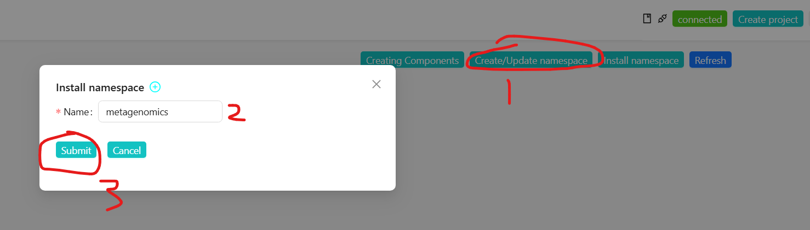
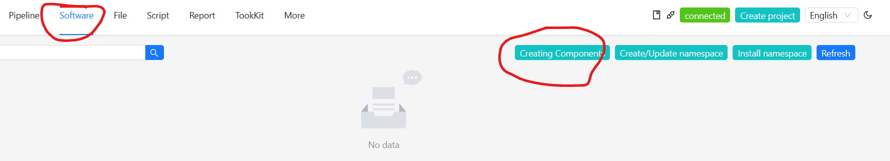
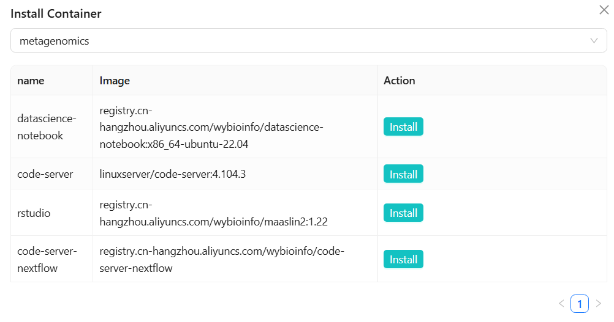
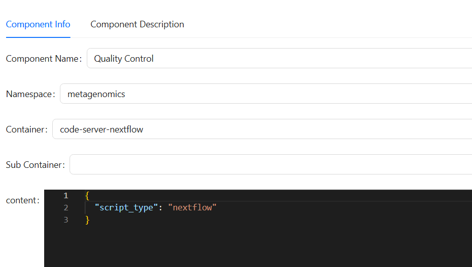

### Step 1: Create a namespace

Creating namespaces for `metagenomics`



### Step 2: Create a software
Click `Software` -> `Creating Components`



+ Component Name: Quality Control
+ Namespace: metagenomics
+ Container: `Install` -> `code-server-nextflow`



content: Enter the following
```
{
  "script_type": "nextflow",
}
```




## Step 3: Create a File