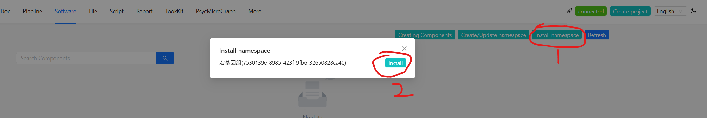

### Copy Pipeline
Start the brave service with the following command:
```
brave  \
    --mysql-url root:123456@localhost:63306/brave \
    --port 5008 \
    --base-dir /opt/brave/workspace \
    --use-https
```
In the startup log, you can see the currently used 'PIPELINE_DIR' directory, which is the directory that the pipeline needs to be installed

```
Using PIPELINE_DIR: /opt/brave/workspace/pipeline
```
To install the pipeline, simply copy the written pipeline directory to this folder. Since brave supports multiple pipelines, it needs to be isolated using namespaces as folders.The name of the command space can be viewed in the `namespace.json` file. 

Take the metagenomic pipeline [pipeline-metagenomics](https://github.com/pybrave/pipeline-metagenomics) as an example:
+ namespace: 7530139e-8985-423f-9fb6-32650828ca40
+ git url：https://github.com/pybrave/pipeline-metagenomics.git
+ PIPELINE_DIR: /opt/brave/workspace/pipeline

The installation command is:
```
git clone \
    https://github.com/pybrave/pipeline-metagenomics.git \
    /opt/brave/workspace/pipeline/7530139e-8985-423f-9fb6-32650828ca40
```
OR
```
git clone \
    git@github.com:pybrave/pipeline-metagenomics.git \
    /opt/brave/workspace/pipeline/7530139e-8985-423f-9fb6-32650828ca40
```

The pipeline directory structure is as follows: 
```
.
├── container.json
├── namespace.json
├── nextflow.config
├── pipeline
├── pipeline_component.json
├── pipeline_component_relation.json
├── README.md
├── script
└── software
```


### Installation of pipelines to the database
+ open [brave-ui](https://pybrave.github.io/brave-ui/)
+ click `Install namespace` -> `Install`

