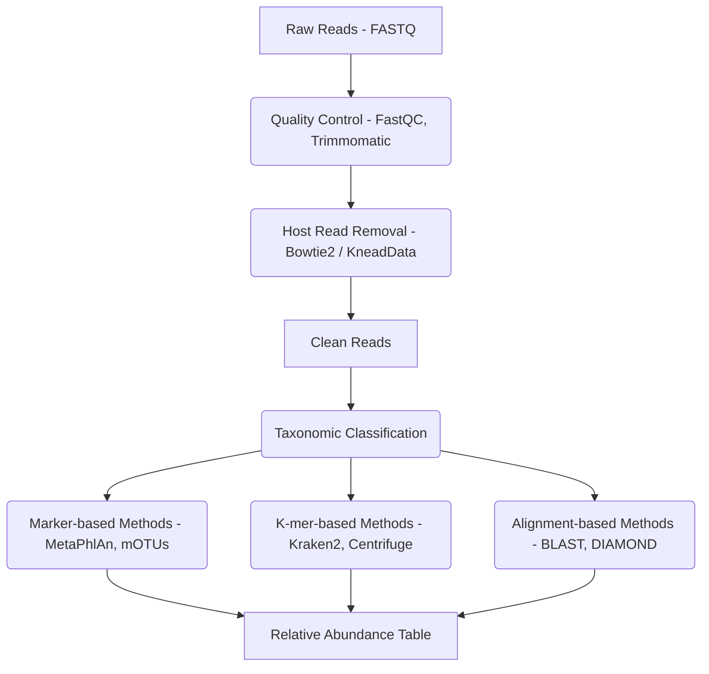

import DocCardList from '@theme/DocCardList';

To better demonstrate how Brave works, we start with the analysis of the macrogenome.

```mermaid
flowchart TD
    A[Raw Reads - FASTQ] --> B(Quality Control - FastQC, Trimmomatic)
    B --> C(Host Read Removal - Bowtie2 / KneadData)
    C --> D[Clean Reads]
    D --> E(Taxonomic Classification)

    E --> F1(Marker-based Methods - MetaPhlAn, mOTUs)
    E --> F2(K-mer-based Methods - Kraken2, Centrifuge)
    E --> F3(Alignment-based Methods - BLAST, DIAMOND)

    F1 --> G[Relative Abundance Table]
    F2 --> G
    F3 --> G
```
<DocCardList />

